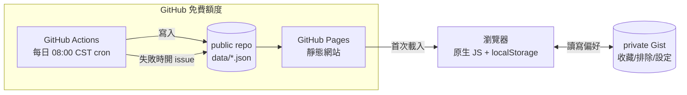

# GigRadar 技術架構與實作規格書（SPEC）

| 項目 | 內容 |
|---|---|
| 文件版本 | v1.0 |
| 撰寫日期 | 2026-09-15 |
| 對應文件 | `GIGRADAR-SRS.md` v1.0（需求與驗收基準，本文件不重複其內容，只講「怎麼做」） |
| 本文件用途 | 開發前的技術決策基準。§11 分期實作計畫是 Phase 4 的直接施工清單 |

---

## 1. 系統架構總覽



- **前端**：純靜態網站，原生 ES Modules + 原生 CSS，無框架、無打包工具（D14）。部署於 GitHub Pages。
- **資料層**：不用資料庫。所有場次資料是 repo 裡的 JSON 檔（`data/events.json` 等），由 GitHub Actions 每日重新產生並 commit。
- **偏好層**：收藏、排除規則、設定存在瀏覽器 `localStorage`，並透過使用者自己的 GitHub 帳號授權寫入一個 **private Gist** 做跨裝置同步（FR-65）。
- **運算全部在前端**：過濾、排序、分組、統計皆是瀏覽器端 JS 運算（NFR-02 <100ms），後端只負責「產生今天的資料快照」。
- **沒有伺服器、沒有帳號系統**：符合 N2、NFR-06。Gist 同步用的是使用者自己對 GitHub 的 OAuth device flow 或 Personal Access Token，GigRadar 本身不持有任何使用者密碼。

---

## 2. Repo 結構

```
gigradar/
├── index.html                  # 時間表（首頁）
├── new.html                    # 新上架
├── favorites.html              # 我的收藏
├── hidden.html                 # 已隱藏管理
├── review.html                 # 待整理
├── add.html                    # 手動新增場次
├── settings.html               # 設定
├── src/
│   ├── app.js                  # 各頁共用的啟動邏輯（載入資料、套用偏好、渲染）
│   ├── state.js                # localStorage 讀寫、Gist 同步邏輯
│   ├── filter.js                # §6 過濾決策樹的唯一實作（所有頁面 import 同一份）
│   ├── render.js                # DOM 渲染輔助（卡片、標籤、徽章）
│   ├── format.js                # 日期/價格/倒數計時格式化
│   └── components/              # 無框架下的「元件」＝渲染函式，非 class
├── styles/
│   ├── tokens.css               # ComponentSpec 畫布對應的 CSS variables（含深色 media query）
│   └── main.css
├── data/
│   ├── events.json              # 目前有效場次（正規化後）
│   ├── artists.yml              # 藝人別名表（人工維護）
│   ├── sources.json             # 各來源最後成功時間、筆數、狀態
│   ├── needs-review.json        # 待整理佇列
│   └── digest.json              # 每日 diff 摘要（新增/更新/移除的場次 id）
├── scripts/                     # GitHub Actions 執行的 Node.js pipeline
│   ├── fetch.mjs                # 入口：逐來源呼叫 adapter
│   ├── adapters/
│   │   ├── kktix.mjs
│   │   ├── tixcraft.mjs
│   │   └── manual.mjs           # 讀取 data/manual-events.json，直接視為一個「來源」
│   ├── normalize.mjs             # 日期/場館/價格正規化＋藝人比對 artists.yml
│   ├── dedup.mjs                  # §4 ID 與去重演算法
│   ├── diff.mjs                   # 與前一版比對，產生 digest
│   └── notify.mjs                 # 來源異常時呼叫 GitHub API 開 issue
├── .github/workflows/
│   └── daily-update.yml
├── GIGRADAR-SRS.md
├── GIGRADAR-SPEC.md
└── README.md
```

**NFR-07 可維護性的落實方式**：新增一個來源＝在 `scripts/adapters/` 新增一個檔案，實作固定介面（見 §5），在 `fetch.mjs` 的來源清單註冊一行。不需要改動 normalize/dedup/diff 任何邏輯。

---

## 3. 資料模型

### 3.1 Event（正規化後，`data/events.json` 裡的單筆結構）

```ts
type Event = {
  id: string;              // 穩定 ID，見 §4.1
  merged_ids: string[];    // 這筆合併吸收過的其他來源 id（含自己）
  title_raw: string;       // 原始標題，供除錯與 AI 輔助解析回溯
  headliners: string[];    // 主秀藝人（正規化後名稱，對照 artists.yml）
  lineup: string[];        // 完整陣容（含配角）；音樂祭時等於全部參演藝人
  is_festival: boolean;    // D5：音樂祭類場次的封鎖判定走 lineup 但不影響主場次顯示
  venue: string;
  city: string;
  date: string;            // ISO 8601 date，e.g. "2026-10-15"
  time: string | null;     // "19:30" 或 null（未公布）
  on_sale_at: string | null; // ISO datetime 或 null
  price_min: number | null;
  price_max: number | null;
  status: "announced" | "on_sale" | "sold_out" | "postponed" | "cancelled" | "ended";
  tags_type: string[];     // 專場/巡迴/拼盤/音樂祭/見面會/簽唱會/音樂劇/古典（可複選，通常 1 個）
  tags_origin: string[];   // 本地/海外/日韓/歐美
  ticket_url: string;      // 優先序最高來源的連結
  sources: {               // 保留全部原始來源連結（AC-12 要求）
    name: string;          // "KKTIX" | "拓元" | "manual"
    url: string;
    raw_id: string;
  }[];
  first_seen_at: string;   // 首次被抓到的時間戳，供「新上架」判定 FR-23
  updated_at: string;      // 最近一次欄位有變動的時間戳，供 FR-34 收藏更新提示
  updated_fields?: string[]; // 這次更新變動了哪些欄位（時間/場館/狀態…）
};
```

### 3.2 Artist 別名表（`data/artists.yml`）

```yaml
- canonical: 深海系樂團
  aliases: ["深海系", "Deep Sea Band"]
  tags_origin_default: 本地
- canonical: ABC Band
  aliases: ["A.B.C. Band", "ABC樂團"]
  tags_origin_default: 歐美
```

人工維護，FR-16/US-16 的「待整理歸位」動作就是往這個檔案加一筆。

### 3.3 UserPrefs（存在 localStorage + Gist，不進 repo）

```ts
type UserPrefs = {
  favorites: string[];              // event id 清單
  excluded_events: string[];        // 單場排除（US-10）
  excluded_artists: string[];       // 封鎖藝人（US-09），存正規化後 canonical 名稱
  excluded_types: string[];         // 封鎖類型（US-11）
  excluded_venues: string[];        // Phase 3, FR-49
  mute_keywords: string[];          // FR-43
  strict_mode: boolean;             // D2
  last_backup_at: string | null;    // FR-64
  gist_id: string | null;           // 使用者自己的 private Gist id
  updated_at: string;               // 供 Gist 衝突比對用
};
```

### 3.4 排除規則的資料結構補充

`excluded_artists` / `excluded_types` / `mute_keywords` 都是「規則」，不是「當下隱藏的場次快照」——這是 AC-42/AC-44 能通過的關鍵：規則存的是條件本身，每次渲染時即時比對，次日資料更新後新場次一樣會被同一條規則擋下，不需要重新操作。

---

## 4. 資料採集 Pipeline

### 4.1 ID 穩定性與去重演算法（對應 SRS R2、AC-12、負向測試）

```
raw_id  = adapter 回傳的來源原生 id（例如 KKTIX 的活動 slug）
id      = sha1( normalize(headliner) + "|" + date + "|" + venue_normalized )
```

- `id` 由**內容特徵**雜湊而來，不是隨機或遞增值：即使 KKTIX 改版換了 URL 結構，只要「主秀＋日期＋場館」不變，`id` 就不變 → 已排除的場次不會因為來源改版而重新出現。
- 跨來源合併：pipeline 對每筆 `RawEvent` 都算出這個 `id`；同一個 `id` 出現在多個來源時，合併為一筆，`merged_ids` 記錄全部命中的 `raw_id`，`sources[]` 保留所有原始連結，`ticket_url` 取來源優先序表（`KKTIX > 拓元 > manual`，可設定）中最高者。
- **早場／晚場不誤併**：`date` 只到天，若同日同場館但 `time` 不同且標題明顯不同（`headliner` 正規化後不同）則不視為同一 `id`（因為 headliner 不同，hash 自然不同）；若真的同名同場館同日不同時段，pipeline 額外加一條規則——當 `time` 差距 >= 3 小時且來源皆明確標示為不同場次時，於 `id` 中額外併入 `time` 分段（午場/晚場）避免誤併，此例外規則寫在 `dedup.mjs` 並附測試案例。
- **手動新增與自動抓取合併**（AC-17）：手動新增的場次一樣先算出 `id`；隔天自動抓取到同一場次時，`id` 相同 → 走一般合併流程，`sources` 多一筆 `manual`，不會重複顯示。

### 4.2 每日更新流程（實作對應 SRS §6.1 flowchart）

`scripts/fetch.mjs` 依序執行：

1. 讀取 `data/sources.json` 取得每個來源上次的成功筆數。
2. 對每個 adapter 執行 `fetch()`（見 §5 介面），有 timeout（30s）與重試（1 次）。
3. 失敗 → 記錄 `sources.json` 該來源 `last_error`，`last_success` 維持不變，該來源本次沿用 `events.json` 中屬於它的舊資料（AC-11 負向情境）。
4. 成功但筆數為 0 且上次 > 0 → 呼叫 `notify.mjs` 開 GitHub issue（AC-14），同時前端從 `sources.json` 的 `status` 欄位讀出異常標示（ErrorState 畫面）。
5. `normalize.mjs`：日期／時間／價格字串轉換為 §3.1 型別；標題丟進簡單的正則＋`artists.yml` 比對抽取 `headliners`/`lineup`；抽不出來的進 `needs-review.json`（FR-16）。
6. `dedup.mjs`：套用 §4.1 演算法。
7. `diff.mjs`：與前一版 `events.json` 比較 `id` 集合與欄位值，產生 `digest.json`（新增/更新/欄位變動列表），供首頁「新上架」與收藏頁「已更新」使用。
8. 若 `digest.json` 顯示零差異 → **不 commit**（NFR-04 精神：沒必要就不動 repo，Pages 也不必重新部署）。
9. 有差異 → commit `data/*.json`，GitHub Pages 自動重新部署。

### 4.3 爬取禮儀（NFR-04）

- 每個 adapter 內部 request 間隔 ≥ 2 秒（`await sleep(2000)`），非平行對同一網域打請求。
- 固定 User-Agent 字串標示 `GigRadar/1.0 (personal use; contact: <email>)`。
- 讀取並遵守目標網域 `robots.txt`（pipeline 啟動時先 fetch 一次快取）。

---

## 5. 資料來源 Adapter 介面

每個 adapter 是一個 ES module，固定 export：

```js
// scripts/adapters/kktix.mjs
export const name = "KKTIX";
export const priority = 1; // 數字越小，去重時 ticket_url 優先序越高

export async function fetch() {
  // 回傳 RawEvent[]，欄位盡量貼近原始資料，不在這裡做正規化
  return [{
    raw_id: "thewalllivehouse-xxxx",
    title_raw: "深海系樂團 Live",
    url: "https://thewalllivehouse.kktix.cc/events/xxxx",
    venue_raw: "The Wall Live House",
    date_raw: "2026/10/15 19:30",
    price_raw: "800",
    status_raw: "on_sale",
  }];
}
```

`manual.mjs` 的 `fetch()` 直接讀 `data/manual-events.json`（手動新增場次表單寫入的檔案，見 §7），格式已經很接近 `RawEvent`，一樣要過 normalize/dedup，確保能跟自動抓取的結果合併（AC-17）。

**Phase 1 來源清單（D9）**：KKTIX、拓元 tixcraft、manual。Phase 2 候補：Accupass、ibon、iNDIEVOX、寬宏、年代。

### 5.1 KKTIX 端點實測結果（2026-09-15，M2 開發時實測）

實測發現 SRS §9.3 D9 的 org 清單裡，8 個場地其實分兩種完全不同的情況，**單一 org 頁面爬取法只對其中一半有效**：

| 場地 | 是否有專屬 KKTIX org 帳號 | 實測 slug |
|---|---|---|
| The Wall Live House | ✅ 自行主辦 | `thewalllivehouse.kktix.cc` |
| 海邊的卡夫卡 | ✅ 自行主辦 | `kafka.kktix.cc` |
| PIPE Live Music | ✅ 自行主辦 | `pipelivemusic.kktix.cc` |
| 浮現藝文展演空間 | ✅ 自行主辦（但有兩個帳號，需都抓） | `emergelivehouse.kktix.cc` + `emergelivehouse2.kktix.cc` |
| **Legacy Taipei** | ❌ 無專屬帳號 | 每場由不同主辦方（廠牌/公司）自己開帳號賣票，例如同一週的三場分別是 `youngteam`、`romanticoffice`、`airheadrecords` 三個不同 org |
| **Legacy Taichung** | ❌ 同上，推測同一營運模式 | 同上 |
| **Revolver** | ❌ 無專屬帳號 | 同上（實測到 `airheadrecords` 等） |
| **Clapper Studio** | ❌ 無專屬帳號 | 同上（實測到 `atc-twn`） |

原因：KKTIX 的「主辦單位（organizer）」概念對應的是廠牌/公司/企劃，不是場地。像 The Wall、卡夫卡這種場地本身兼營主辦（大部分場次自己開票）才會有一個好用的 org 頁面；Legacy／Revolver／Clapper 這類「租場地給外部主辦方」的場館，場次分散在幾十個不同 org 帳號下，沒有單一頁面可以爬。

**解法**：改用 KKTIX 的全站搜尋 `https://kktix.com/events?search={場館關鍵字}`（實測 `search` 才是正確參數名，`q`/`query` 無效），這是跨 organizer 的全文檢索。抓回來的每筆結果仍需要**在活動詳細頁比對場館欄位**（見下方 HTML 結構）以排除誤命中（例如活動描述提到「上次在 Legacy 演出」但這次其實在別的場地）。

因此 `kktix.mjs` 內部需要兩種抓取模式：

```js
// SPEC §5.1 — 兩種 KKTIX 抓取策略
const ORG_PAGE_VENUES = [
  { org: "thewalllivehouse", venueMatch: "The Wall" },
  { org: "kafka", venueMatch: "海邊的卡夫卡" },
  { org: "pipelivemusic", venueMatch: "PIPE" },
  { org: "emergelivehouse", venueMatch: "浮現" },
  { org: "emergelivehouse2", venueMatch: "浮現" },
];

const SEARCH_VENUES = [
  { keyword: "Legacy Taipei", venueMatch: /^Legacy(\s|$)/ },   // 場館欄位實測只寫 "Legacy"，靠地址分台北/台中
  { keyword: "Legacy Taichung", venueMatch: /^Legacy(\s|$)/ },
  { keyword: "Revolver", venueMatch: /^Revolver/ },
  { keyword: "Clapper Studio", venueMatch: /^Clapper/ },
];
```

Legacy Taipei 與 Legacy Taichung 的場館欄位都只寫「Legacy」，需要另外比對地址（台北市 vs 台中市）才能分辨，實作時務必寫測試案例覆蓋這個情況，避免兩個城市的場次互相搞混。

**兩個踩過的坑（M2 實作記錄）**：

1. **adapter 檔案裡絕對不要讓內部函式直接呼叫裸的 `fetch(...)`**——每個 adapter 依 §5 介面規範要 `export async function fetch()`，這會在整個模組內把全域 `fetch` API 遮蔽掉（function 宣告會 hoist）。結果是模組內任何地方寫 `fetch(url, {...})` 都會呼叫到自己那個零參數的 adapter `fetch()`，等於無窮遞迴呼叫自己，且因為每層遞迴前都有 `await sleep(2000)`，行為看起來就像「卡住但每 2 秒還有動靜」，非常難從外部行為判斷是死迴圈還是真的網路慢。**解法：模組內一律用 `globalThis.fetch(...)` 呼叫真正的網路 API**，`kktix.mjs` 已經這樣修正並留了註解，之後新增 adapter（拓元等）務必比照辦理。
2. `https://kktix.com/events?search=...` 這個全站搜尋端點實測第一次請求偶爾會回 403（懷疑是輕量的機器人偵測），**但重試一次幾乎都會成功**——這正是 §4.3 要求的「timeout + 重試一次」機制存在的理由，實測中每次都是重試後就過了，不需要更複雜的處理。

### 5.2 KKTIX 頁面 HTML 結構（供 `normalize.mjs` 對照）

**Org 列表頁**（`https://{org}.kktix.cc/`，僅列出「近期公開活動」，未含價格）：

```
.current-events #event-list li.clearfix
  h2 > a                          -> title_raw, url（url 最後一段 slug 當 raw_id）
  .date .timezoneSuffix           -> date_raw，格式 "2026/09/16 20:00(+0800)"
  .description                    -> 簡介文字（可選，用於除錯）
```

**活動詳細頁**（`{url}`，含完整票價，normalize 階段一定要抓這層，org 列表頁資訊不夠用）：

```
.header-title h1                          -> title_raw（跟列表頁一致，取這裡更保險）
.event-info ul.info li:nth-child(1)       -> 完整日期時間（含中文星期，格式同列表頁）
.event-info ul.info li:nth-child(2)       -> "{場館名} / {完整地址}"（用 " / " split）
.organizers a:first-of-type                -> 主辦單位顯示名稱
table tbody tr                             -> 每一種票種一列
  td.name                                  -> 票種名稱
  .period-time .time .timezoneSuffix       -> 開賣/截止時間（各一個 span，前者開賣後者截止）
  td.price .currency-value                 -> 價格數字（有千分位逗號，需去除後 parseInt）
  .status.closed（若存在）                  -> 該票種已結束販售
```

**status 推導邏輯**：任一票種的販售區間涵蓋「現在」→ `on_sale`；所有票種都還沒到販售開始時間 → `announced`，`on_sale_at` 取最早一個開賣時間；所有票種都已經 `.status.closed` 且活動日期還沒到 → 暫定為 `sold_out`（無法區分「賣完」與「主辦方單純關閉線上售票改現場賣」，這是已知限制，寫進 README 讓未來的你知道，別誤以為是 bug）。

### 5.3 拓元 tixcraft 端點實測結果（2026-09-15，M3 開發時實測）

跟 KKTIX 完全不同的情況：**拓元有主動的反爬蟲防護，且列表頁與詳情頁的防護強度不一樣**。

- `https://tixcraft.com/activity`（節目列表頁）：純 UA／Referer 檢查，帶正常瀏覽器的 User-Agent 字串就能拿到完整 HTML（伺服器端渲染，200 OK）。裸 UA（例如 `curl` 預設或 Node `fetch` 沒帶 User-Agent）會被擋，回應 `{"response":"block"}`（HTTP 403）。
- `https://tixcraft.com/activity/detail/{slug}`（節目詳情頁，**票價在這裡**）：防護強得多。同樣的瀏覽器 UA、Referer、甚至帶著從列表頁拿到的 session cookie 一起送，一律回 `{"response":"identify"}`（HTTP 401）。實測用真瀏覽器（有執行 JS）可以正常看到內容，代表這層防護會執行某種 JS 挑戰（常見於 Akamai／PerimeterX 類服務），單純的 `fetch()` 過不去。

**Phase 1 決策（D16，2026-09-15）**：拓元 adapter **只爬節目列表頁**（標題、日期、場館名稱），**不爬詳情頁**，代價是拿不到票價與售票狀態（`price_min/max` 留 `null`，`status` 一律 `announced`，前端顯示「票價請至頁面查看」並附上 `ticket_url` 導流）。要拿到價格需要上無頭瀏覽器（Playwright/Puppeteer）通過 JS 挑戰，這對 Phase 1 的免費額度／零維護目標（NFR-06、G5）不划算——GitHub Actions 加無頭瀏覽器會顯著拉長執行時間、增加相依套件的維護負擔，且拓元本來就是「大型海外巡演」的通路，使用者通常會自己點進 `ticket_url` 查價，比首頁直接顯示價格的急迫性低。若之後真的需要，可列入 Phase 3 再評估。

**列表頁 HTML 結構**（`#all` 分頁，即「全部節目」，是「近期演出」與「最新開賣」兩個分頁的超集，直接爬這個就好）：

```
.eventbl .row.align-items-center   -- 每筆活動一個區塊，但同一筆會重複出現在頁面裡的不同版型（RWD 手機/桌面各一份），務必用 href 去重
  .date                             -- "2027/05/01 (六)  ~ 2027/05/02 (日) " 或單日 "2026/12/10 (四)"
  .text-bold a                      -- 標題 + href（/activity/detail/{slug}，slug 當 raw_id）
  .text-small.text-med-light        -- 場館名稱（純文字，無地址，例如 "高雄國家體育場(世運主場館)"、"Zepp New Taipei"）
```

**城市判定**：列表頁場館欄位沒有地址，無法像 KKTIX 那樣從地址判斷城市，只能比照 `artists.yml` 的精神，維護一份小型場館→城市對照表（`data/venues.yml`），碰到表裡沒有的場館就留 `city: null`，之後人工補。

**robots.txt 確認**：`Disallow` 只列了 `/activity/game/`、`/activity/search-suggest/`、`/ticket/area/`、`/ticket/ticket/`、`/ticket/verify/`，`/activity` 與 `/activity/detail/*` 都不在其中，抓取合規（NFR-04）。

---

## 6. 前端過濾決策樹（實作規範）

`src/filter.js` 是**唯一**允許實作這段邏輯的地方，所有頁面（首頁、新上架、收藏）都呼叫同一個函式，不得各自重寫，否則 FR-33/FR-44 容易在某個頁面漏掉：

```js
// src/filter.js
export function resolveVisibility(event, prefs, viewFilters) {
  if (isPast(event.date)) return { bucket: "ended" };
  if (prefs.favorites.includes(event.id)) return { bucket: "show", pinned: true };
  if (prefs.excluded_events.includes(event.id)) return { bucket: "hidden", reason: "event" };
  const hitArtist = prefs.strict_mode
    ? event.lineup.some(a => prefs.excluded_artists.includes(a))
    : event.headliners.some(a => prefs.excluded_artists.includes(a));
  if (hitArtist) return { bucket: "hidden", reason: "artist" };
  if (event.tags_type.some(t => prefs.excluded_types.includes(t))) return { bucket: "hidden", reason: "type" };
  if (prefs.mute_keywords.some(kw => event.title_raw.includes(kw))) return { bucket: "hidden", reason: "keyword" };
  if (!passesViewFilters(event, viewFilters)) return { bucket: "filtered" }; // 不計入排除統計
  return { bucket: "show" };
}
```

順序**不可調換**（SRS §6.3 明文要求）：已結束 → 已收藏（提前短路，永不被排除規則擋下）→ 單場排除 → 藝人 → 類型 → 關鍵字 → 畫面篩選器。`hidden` 各 reason 的計數加總即為頁尾「另有 N 場被規則隱藏」的數字；`filtered`（城市/月份/價格篩選器篩掉的）不計入這個統計。

---

## 7. 手動新增場次（FR-17）的落地方式

因為前端沒有伺服器可以直接寫 repo，`add.html` 的「儲存」實際上是：

1. 寫入使用者自己的 `localStorage`（`manual_pending` 陣列），畫面上立刻可見、可收藏、可排除（符合 AC-17 的「行為與自動抓取一致」——前端渲染時把 `manual_pending` 跟 `events.json` 合併成同一個清單餵給 `filter.js`）。
2. 同步寫進使用者的 Gist（跟 UserPrefs 一起同步），這樣手機新增、桌機也看得到。
3. 下一次 GitHub Actions 執行時，pipeline **讀不到**使用者的 localStorage/Gist（那是私人資料，pipeline 沒有存取權限）——所以 AC-17 第二條「手動新增的場次日後也被自動抓到時合併為一筆」的實作方式是：**使用者自己**在待整理頁或設定頁有一個「提交到 repo」的動作（生成一個 `manual-events.json` 的 PR 內容／GitHub Gist 貼上教學），或最簡化的 Phase 1 版本：手動新增的場次**永遠只存在該使用者的本機/Gist**，不進 `data/manual-events.json`，因此它是「個人補件」而非「全站資料」；若隔天自動抓到同一場次（`id` 相同），前端合併時以 `events.json` 版本為主，local 版本視為重複而不重複顯示（用 `id` 比對，滿足 AC-17 的「不得重複顯示」，但不需要真的寫回 repo）。
   - 這個決定比 SRS 原文更保守（原文語意可能暗示要進 repo），**請在開發前確認**：手動新增的場次是否需要讓「未來的你」在其他裝置上也看得到即使沒開過那台裝置的 Gist？如果是，需要走 GitHub API 由使用者的 PAT 直接 commit `data/manual-events.json`，技術上可行（前端用使用者自己的 PAT 呼叫 GitHub Contents API）但會把「寫 repo 的權限」交給前端 JS，需額外考慮 PAT 的儲存風險。本規格書先採「存在 Gist、不寫 repo」的簡化版本。

---

## 8. Gist 同步機制（FR-65）

- 使用者在設定頁「連接同步」，走 GitHub OAuth Device Flow 或貼上一個僅有 `gist` 權限的 Personal Access Token（Phase 1 用 PAT 較簡單，不需要自架 OAuth callback server）。
- Token 本身存在 `localStorage`（風險：XSS 或裝置遺失會外洩；因為是個人單機工具且 token 權限僅限 gist，風險可接受，於 README 註明）。
- 同步策略：**last-write-wins**，比較雙方 `UserPrefs.updated_at`，取較新者。開站時：
  1. 讀本機 `UserPrefs`。
  2. 呼叫 Gist API 讀雲端版本。
  3. 比較 `updated_at`，較新的一份覆蓋較舊的一份（雙向同步，不做欄位級合併）。
  4. Gist 連不上（離線／token 失效）→ 直接用本機版本繼續運作，畫面顯示同步失敗提示，**不清空**本機資料（AC-65 負向測試）。
- 每次使用者操作（收藏/排除/設定變更）→ debounce 2 秒後寫回 Gist，避免每次點擊都打 API。

---

## 9. 深淺色模式（FR-27）

`styles/tokens.css` 定義一份 CSS variables（對應設計稿 ComponentSpec 畫板的兩組 token），淺色寫在 `:root`，深色寫在 `@media (prefers-color-scheme: dark)`，不做手動切換開關（跟隨系統即可，符合 SRS 範圍）。所有畫面樣式一律用 `var(--xxx)`，不得寫死色碼，這樣新增畫面時深色模式是自動生效的，不需要每頁另外處理。

---

## 10. GitHub Actions 設定

```yaml
# .github/workflows/daily-update.yml
name: Daily Update
on:
  schedule:
    - cron: "0 0 * * *"   # 08:00 CST = 00:00 UTC（D1）
  workflow_dispatch: {}    # 方便手動觸發除錯
jobs:
  update:
    runs-on: ubuntu-latest
    steps:
      - uses: actions/checkout@v4
      - uses: actions/setup-node@v4
        with: { node-version: 20 }
      - run: node scripts/fetch.mjs
      - run: |
          git config user.name "gigradar-bot"
          git config user.email "actions@users.noreply.github.com"
          git add data/
          git diff --cached --quiet || git commit -m "chore: daily data update $(date +%F)"
          git push
```

失敗告警（`notify.mjs`）用 `actions/github-script` 或直接呼叫 GitHub REST API（`repos/{owner}/{repo}/issues`），用內建的 `GITHUB_TOKEN` 即可，不需要額外密鑰。

---

## 11. 分期實作計畫（Phase 4 施工清單）

依 SRS §8 Phase 1 範圍，拆成可獨立驗收的里程碑：

| # | 里程碑 | 內容 | 對應 AC |
|---|---|---|---|
| M1 | 專案骨架 | repo 結構、`tokens.css`（從 ComponentSpec 畫板搬值）、靜態頁面殼（無資料，寫死一筆假資料） | — |
| M2 | KKTIX adapter + normalize | 先做一個來源打通全流程：fetch → normalize → 輸出 `events.json` | AC-11, AC-15 |
| M3 | dedup + ID 演算法 | 加入拓元 adapter，驗證跨來源合併、早晚場不誤併 | AC-12 |
| M4 | 前端渲染 + filter.js | 時間表首頁完整可動（不含收藏/排除，先讀 `events.json` 渲染） | AC-21, AC-24 |
| M5 | 收藏 + 排除規則（localStorage） | US-06~14 全部功能，含復原 toast、已隱藏管理頁 | AC-33, AC-41/42/44/45 |
| M6 | 新上架 + digest | `diff.mjs` + 新上架頁 | AC-23 |
| M7 | 手動新增場次 | `add.html` + localStorage 合併邏輯 | AC-17 |
| M8 | 待整理頁 | `needs-review.json` 渲染 + 指派藝人寫回 `artists.yml`（本機開發時手動 commit，非使用者操作） | — |
| M9 | Gist 同步 | 設定頁連接、雙向同步、離線 fallback | AC-65, AC-63 |
| M10 | 告警與來源狀態 | `notify.mjs`、`sources.json`、設定頁來源儀表、ErrorState 畫面串接 | AC-14 |
| M11 | GitHub Actions 上線 | cron 排程、連續兩日自動更新測試 | Phase 1 完成定義 |
| M12 | 覆蓋率抽樣 | 對照既有彙整站抽樣 30 場人工比對 | G4 |

**建議順序**：M1→M4 先把「看得到資料」的骨架打通（不含任何個人化），再做 M5 排除/收藏（產品核心），最後補 M9~M12 維運與上線相關。每個里程碑結束時對照右側 AC 手動測一次，不要累積到最後才測 AC-42/AC-44（風險最高的兩條）。

---

## 12. 決策紀錄（開發前拍板，2026-09-15）

| # | 決策 | 結論 |
|---|---|---|
| S1 | 手動新增場次的資料歸屬 | **只存個人 Gist，不寫回 repo**。手動新增場次是「個人補件」，同步靠 Gist 跨裝置；若隔天被自動抓到，靠 `id` 相同去重，不重複顯示，但不會變成全站資料 |
| S2 | Gist 認證方式 | **Personal Access Token**（僅 `gist` 權限），使用者自行在 GitHub 產生後貼到設定頁，不自架 OAuth server |
| S3 | GitHub repo 持有者 | 使用者現有 GitHub 帳號；repo 建立與推送在 M11（上線）階段執行，M1~M10 先在本機開發與驗證 |

日後若要變更，請在此表加註變更日期與理由。
